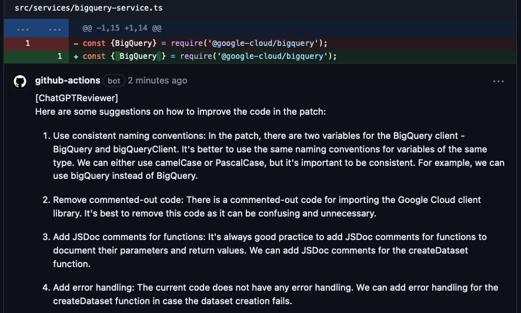

# chatgpt-code-reviewer

GitHub action that adds ChatGPT code review comments to pull requests. This service uses the GitHub REST API and the OpenAI API to generate suggestions for pull request changes.

Example:


### A few notes on what to expect

* This is not intended to replace an actual code review done by a developer. It's meant to spot things humans could miss, provide instantaneous feedback and fix immediately, before a peer has had time to review.
* While in many of the cases we've seen the comments are great, it isn't always right, so be critical and decide for yourself what needs fixing and what does not.

### Before you start

By using this repository you acknowledge and approve of the fact that:

- Your code would be sent to OpenAI servers for generating code review suggestions.
- Authors of this github action have no responsibility whatsoever to the consequences of the above, and they would not be liable for anything that happens as a result of using this action.

---

### Getting Started

To use this github action, you will need to have a GitHub account and an OpenAI API key. Also you will need to configure a GitHub action workflow.

1. Visit https://platform.openai.com/account/api-keys to generate a new OpenAI API key.
2. Add new key with a name `OPENAI_API_KEY` as described [here](https://docs.github.com/en/actions/security-guides/encrypted-secrets#creating-encrypted-secrets-for-a-repository). As a value set generated OpenAi Api key from the step 1
3. In a repository you want to run this action, create a file: `.github/workflows/chatgpt-code-reviewer.yml` with the next content:

   ```yml
   name: chatgpt-code-reviewer
   run-name: chatgpt-code-reviewer
   on: [pull_request]
   jobs:
     chatgpt-code-reviewer:
       runs-on: ubuntu-latest
       steps:
         - name: ChatGPT Review
           uses: magnificode-ltd/chatgpt-code-reviewer@v0.0.8
           # with:
           # model: gpt-3.5-turbo
           # max_tokens: 4096
           env:
             GITHUB_TOKEN: ${{ secrets.GITHUB_TOKEN }}
             OPENAI_API_KEY: ${{ secrets.OPENAI_API_KEY }}
   ```

   ### Parameters

   | Parameter      | Description                                                               | Required | Default Value |
   | -------------- | ------------------------------------------------------------------------- | -------- | ------------- |
   | model          | OpenAI model                                                              | false    | gpt-3.5-turbo |
   | max_tokens     | OpenAI TPM                                                                | false    | 4096          |

   ### Environment Variables
   | Variable      | Description                                                               | Required | Default Value |
   | -------------- | ------------------------------------------------------------------------- | -------- | ------------- |
   | GITHUB_TOKEN   | provided to you automatically by GitHub, used to send out review comments | true     | ""            |
   | OPENAI_API_KEY | API key used to invoke OpenAI                                             | true     | ""            |

---

### About

<a href="https://bit.ly/3nXn4EN">
   
</a>

This repository was created & is maintained by MagnifiCode. We provide web development services. We specialize in React/Node/AWS (etc) and are available for [hire](https://bit.ly/3IcWXR3). Learn more about us on our [website](https://bit.ly/3nXn4EN).

Follow us on [Twitter](https://twitter.com/magnificodehq) and [LinkedIn](https://www.linkedin.com/company/magnificode-software) for more updates.

---

### Known Issues

Currently we add comments for a specific patch on the first line of the patch, so you may see a suggestion a bit higher on the file than it should be.
In future versions we want to fix this. See our issues page for other issues.
If you found any issue that's not in the issues area, feel free to create one and submit PRs.

---

### Dependencies

- @actions/github: A GitHub Actions toolkit for interacting with the GitHub REST API.
- openai: A library for interacting with the OpenAI API.
